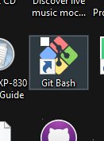
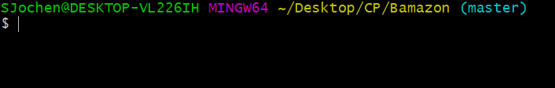
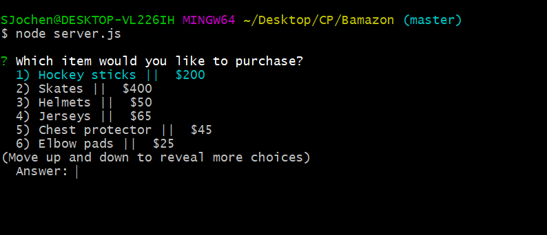
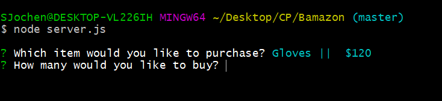
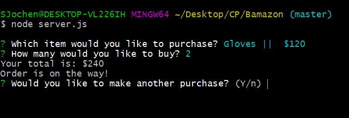
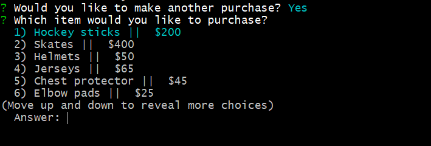

# Bamazon
In this project, I created a program that works on the command line where the user is asked which product they would like to buy from the list of products. Examples of how the product works are below.

## Why Build this project?
This app is a cool way to help users explore how the command line/terminal work while being able to return specific data based on what someone inputs. It is a fun project to play around with and see what it is capable of.

## How to get started!
To use this app, you need to have git bash. The logo should look something like this . Once you have made your way to the terminal and clone the app to your computer, you can get started. You will need to navigate to the app within git bash like this .

Once you are in the app you will be asked to select a product. Use the arrow keys to select a product and then press enter. .

After you have selected your product you will be asked how many you would like. Answer this with a number..

The app will then show you your total and tell you your order is on the way!. Once your purchase is made, you will be asked if you would like to make another purchase

If you select more units of the product than are available it will tell you the order cant be complete.

If you choose yes it will start the process over . If you choose no, the connection will end .

## Need Help?

If at any point you cant seem to get the app working properly and would like some assistance, just follow the link bellow to my portfolio and send me an email. I would be happy to help!

Link: https://sjochen.github.io/Responsive-Portfolio/
